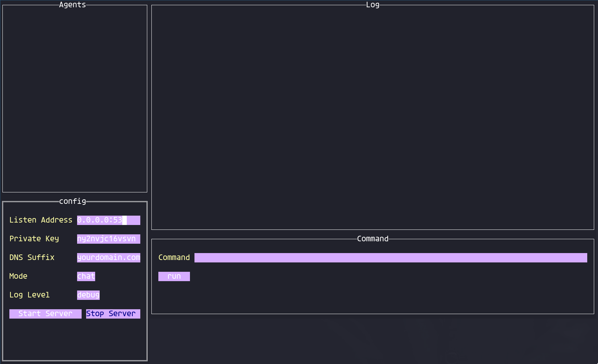

# dnspot
End-to-end Encrypted DNS Tunneling and C2 framework

# Motivation
I was always fascinated by Thinkst's canary technology. Thinkst canaries exclusively use DNS tunneling to act as C2 and push configuration. I wanted to build something similar. In the meantime, I had to do more work on DNS since it's one of my favorites. 

I'm hoping to later on evolve this into a Deception framework, especially in areas that opening a fw rule for your canary is not an optimal solution.

Note that this project is in alpha stage. Crashes, bugs and sometimes duplicate actions are expected. PRs and contributions are more than welcome. If you want to see where to start, do a find on `//todo:`, you'll find a bunch of them! 

# Supported platforms
Right now the aim is to make it work for Linux/*NIX. Honestly don't see the "good guy" point of having this on Windows, so not really keen to have a Win implementation of the agent itself. for server, I think Windows can work. Haven't tested it though. 

Can't see why it wouldn't run on Mac, Rpi, etc since the libraries are not `CGO` dependent. Test it and let me know so I can add it to supported platforms :)


# Architecture
`dnspot` uses a simple implementation of NIST's P-256 elliptic curve + SHA-256 to transfer data securely over an A query. The payload is encoded using an implementation of `base36`, to ensure case sensitivity is not an issue while in transit. The responses from the C2 to each agent is a `CNAME` response with the same algorithm, so a lot of underlying C2 and Cryptography functions are shared between the agent and the server. A custom transport protocol has been implemented to ensure the larger payload's delivery. Before encryption, each packet looks like this:

```go
type MessagePacket struct {
	Payload      [PAYLOAD_SIZE]byte 
	TimeStamp    uint32             
	PartID       uint16            
	ParentPartID uint16          
	MessageType  MessageType
	IsLastPart   bool     
}
```

If there's a large command or response, this message structure allows it to be split into multiple queries, while maintaining the cryptographic integrity of each packet, since the signature and encryption will happen on top of `MessagePacket`, meaning all the `MessagePacket` will be encrypted and signed, not just the payload. Right now, `PAYLOAD_SIZE` is 80 bytes, which gives the user the ability to have up to ~30 character DNS suffix and the system still works. 

The server includes a TUI interface to see the list of agents beaconing to the server:



By default, the beacon (which I call `healthcheck`), will happen every 10 seconds. Each 60 seconds, there's a clean-up job on the server side to remove idle agents. After the agent registers itself with the server, the server can send commands to it. the server put the agent in `runcommand` mode, and will respond to the next `healthcheck` with a `runcommand` payload, and proceeds with sending the payload to the agent. After the payload is delivered, the agent will run the command. For security and stability purposes, there's a 2 second timeout for each command's run, so any accidental `ping` command won't send the agent to abyss :) after the command has finished, the `stdout` and `stderr` of the command is captured and sent to the server via `runcommandres` message type. after both these transactions are finished, both the server and the agent will go back to `healthcheck` mode and can run a different command if need be. 

The project's long-term purpose is to remove the need for a UI, focusing more on building a framework that can be imported and used in any other app, to act as a messaging protocol over DNS.

# Getting Started

## Get a (sub)domain
In order to make this work over the internet, you need to have a NS record pointing to your internet-accessible DNS server (a Digitalocean VPS for example) with port 53 open. If you're dedicating a full TLD to this, you need to go to your registrar's administration page, and change your DNS servers and make them point to your VPS. If you want to use the sub-domain method, you need to go to your DNS administration (bind configuration or your cloud DNS provider's web admin page) and add a NS record, that points the subdomain you'd like to your VPS. For example, if your VPS's public IP is 1.1.1.1 and your domain is example.com, and you'd like to have c2.example.com as your C2 suffix, you need the following record:

```
NS c2.example.com   1.1.1.1
```

Depending on your provider, this might be different. For example, Cloudflare only allows FQDNs to be set as NS record's values, so you might need to add another A record to point to your VPS IP and your NS record to point to the A record, like so:

```
A myns.example.com  1.1.1.1
NS c2.example.com   myns.example.com
```

## Generate Keys
This part should be easy. Run the following:

``` bash
$ dnspot generate
public  key: eg0he2d9cr3hpvt3z76trvkl7n2bivgscpwd5xfgn0oqgqlq00
private key: 5slcifus86ojqs51ubctih0p35izi3x6ynyo2q2pnqs7syvnqa
```

you need to run this once for the server, and once for each agent you're planning to run.

## Run the Server

For running the server, you must provide a suffix and a privatekey. Everything else is optional. Keep in mind that if you don't use the `enforceClientKeys` option, anyone that has your server's public key, can register themselves as an agent. If you're using `enforceClientKeys`, `acceptedClientKeys` becomes mandatory. You can also provide a `logFile` address to save the output persistently. Otherwise it's all gone when you press "Ctrl+C".

```
Usage:
  dnspot server [arguments] [flags]

Flags:
      --acceptedClientKeys strings   Accepted Client Keys
      --dnsSuffix string             Subdomain that serves the domain, please note the dot at the beginning and the end (default ".example.com.")
      --enforceClientKeys            Enforce client keys. Need to provide a list of accepted public keys if set to true
  -h, --help                         help for server
      --listenAddress string         Listen Socket (default "0.0.0.0:53")
      --logFile string               Log output file. Optional
      --logLevel uint8               Log level. Panic:0, Fatal:1, Error:2, Warn:3, Info:4, Debug:5, Trace:6 (default 1)
      --privateKey string            Private Key used

```

## Run the Agent(s)
To run each agent, you must provide a suffix, a privatekey and also the server's public key. By default, the agent reads `/etc/resolve.conf`, and will leverage the first DNS server and its DNS server address, but you can provide another `serverAddress` in the socket format: `1.1.1.1:53`. DoT, DoH and DoQ are not (yet) supported. 

```
Usage:
  dnspot agent [arguments] [flags]

Flags:
      --dnsSuffix string         Subdomain that serves the domain, please note the dot at the beginning and the end (default ".example.com.")
  -h, --help                     help for agent
      --loglevel uint8           log level. Panic:0, Fatal:1, Error:2, Warn:3, Info:4, Debug:5, Trace:6 (default 1)
      --privateKey string        Private Key used
      --serverAddress string     DNS Server to use. You can specify custom port here. Leave blank to use system's DNS server
      --serverPublicKey string   Server's public Key
```

## Profit
The agent should instantly show up in Server's TUI, identified by its public key. You can then select an agent from the left panel (by clicking on it), and type the desired command and wait for the output to show up.

Couple of notes:

- Source IP is pretty much useless in DNS, so `dnspot` discards it immediately, and focuses on public key of each agent. 
- Command's execution is done after the next `healthcheck`, so the interactive shell feel is not there. However, there are plans to make the healthcheck interval dynamic, which makes it possible for us to build an interactive shell if need be.
- The project does NOT aim to be discrete. It does NOT aim to be covert. The last thing I want is giving the attackers another tool. It's intended to be noisy with 200+ chars A queries and CNAME responses, so any IDS/IPS/EDR can easily detect it.

# TODO
As mentioned above, `dnspot` is buggy. Polishing the source and framework is the main goal. There are a bunch of duplicate code and functions need to be fixed. There are also a lot of "static" numbers I put in the code, that need to be extracted and at least be a list of const values in the config, rather than scattered within the code. 

There's also a plan to implement file transfer both from server to agent and vice-versa. I'm thinking of leveraging a high-ratio compression algorithm to make it different than `cat`'ing a file to the agent. ideas are welcome!

- [] File transfer
- [] better configuration
- [] TUI improvements and different command options
- [] Agent watchdog to reset agent on failure or error rather than crash and die
- [] DoT and DoH support
- [] Decouple framework and UI to make it usable outside the project
- [] Standard API and documentation
- [] Possible Web UI for server
- [] Alternative Query and response types (TXT, ANY, etc)
